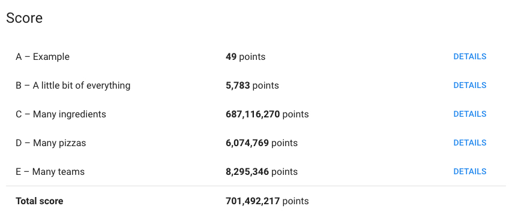

# brainstorm solutions 

- greedy approach, select the largest team and send pizza to them first, but I suspect this is a local minima
- reason: (a+b)^2 >= a^2 + b^2, so it is always better to give pizza to larger team first 

# data structure to use 

- hash map to store the pizzas 
- hash map to store the results 

- array to store the currently used ingredients

# complexity analysis 

- for each team of size N, we need to 
- go over the pizzas to select the one with largest new ingredients, O(PQ), where P is number of pizzas, Q is number of elements 

- overall time complexity is O(MNPQ), where M is total team number 

- space complexity: O(M + P + Q) 

# results 

- got `701492217` points overall, I have seen someone got `480,660,824`, and mine is `220831393` more than that

